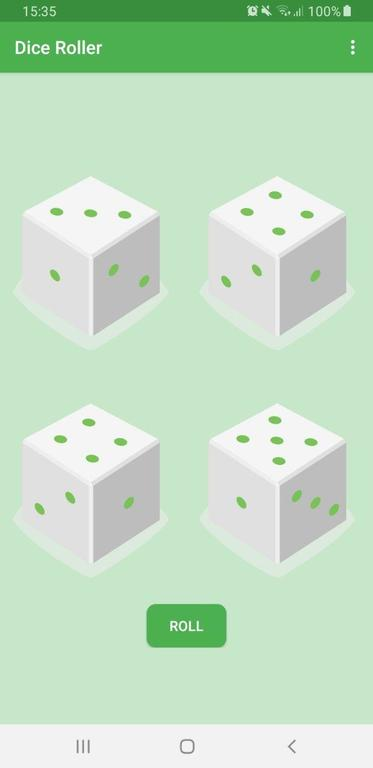
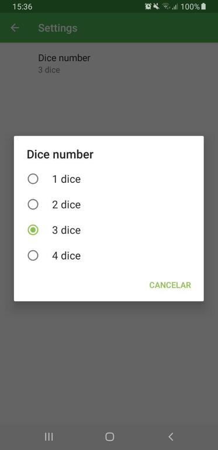
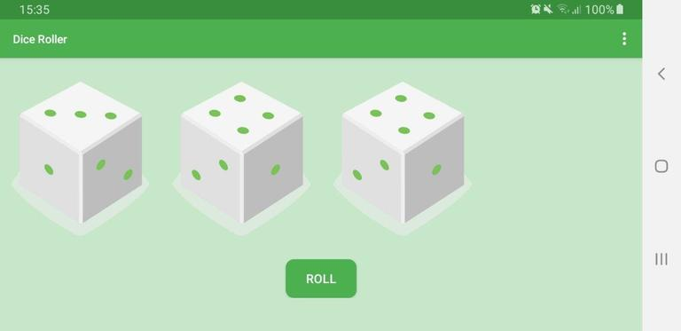

# Dice Roller

Kotlin android application that allows you to roll dice

## Application description

The apps simulate a real dice and can be used for a nice session of board games with friends!

The number of dice available is 4, being possible to select the number of dices in screen (from 1 to 4). 

You can roll each dice separately or roll them all clicking on the roll button.

## Application screenshots

 
-
